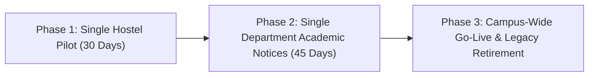

# Campus Life OS — Institutional Adoption & Deployment Guide
**BPUT Hackathon 2026 • Problem Statement 07**

---

## 1. Executive Summary
Campus Life OS is designed to address the deep operational friction of academic institutions where everyday student needs are currently scattered across **"four apps, six notice boards, two WhatsApp groups, and one paper register."**

Rather than enforcing a disruptive, high-risk "rip-and-replace" approach, Campus Life OS is architected as an **overlay operations layer** that unifies student workflows, staff task queues, and executive administration with zero data lock-in and high fault tolerance.

---

## 2. Institutional Data Requirements
To commission Campus Life OS in an academic campus (e.g. BPUT affiliated engineering colleges), the institution provides four core datasets:

| Dataset | Required Fields | Source Entity | Format |
| :--- | :--- | :--- | :--- |
| **Student Roster** | Full Name, Roll No / Reg ID, Email, Phone, Branch, Academic Year | Academic Section / Registrar | CSV / XLSX |
| **Hostel & Room List** | Hostel Name, Block, Floor, Room Number, Capacity, Current Occupants | Chief Warden Office | CSV |
| **Staff & Department Mapping** | Staff Name, Role (`STAFF`, `WARDEN`, `FACULTY`, `ADMIN`), Department, Assigned Block/Hostel, Phone, Email | Estate Office / HR | CSV |
| **Existing Academic Timetable** | Course Code, Course Title, Day of Week, Start Time, End Time, Room/Hall, Faculty Name, Target Batch | Department Academic Committee | CSV / JSON |

---

## 3. Data Ingestion, Column-Mapping Wizard & Integrity Engine

### 3.1 Automated Ingestion Wizard
Campus Life OS includes an administrative CSV upload pipeline with interactive column mapping:
1. **Header Introspection:** Automatically matches synonyms (e.g., `Reg No`, `University Roll`, `Enrollment ID` $\rightarrow$ `roll_no`).
2. **Type Coercion & Schema Validation:** Validates email structures, 10-digit mobile numbers (`+91`), and room conventions (`[A-Za-z0-9\-]`).
3. **Duplicate Detection & Re-conciliation:**
   - Detects collisions on unique keys (`roll_no`, `email`, `phone`).
   - Offers administrator actions: *Merge (enrich existing)*, *Overwrite*, or *Skip with Audit Flag*.
   - Never aborts the entire batch due to a single malformed row; generates a downloadable rejected-rows error CSV.

---

## 4. Overlay Architecture — Preserving Existing Systems
A non-negotiable principle of Campus Life OS is **non-disruptive integration**:

> **Critical Principle:** Campus Life OS sits **on top** of existing campus systems rather than tearing them out.

### 4.1 Biometric Attendance Systems
- **Legacy Reality:** Colleges have finger-print or facial recognition scanners already mounted at departmental entrances and hostel gates.
- **Campus Life OS Approach:** The platform does **not** demand discarding physical biometric scanners. Instead, an adapter service (`AttendanceAdapter`) pulls transaction logs via standard SQL views or REST webhooks into the SQLite database.
- **Value Added:** Raw punch logs are translated into student-visible attendance percentages with real-time **< 75% shortage alerts** and automated condonation eligibility calculations.

### 4.2 Legacy ERPs & Student Fee Portals
- Government portals (e.g. State Scholarship Portals, SB Collect, Examination ERPs) remain the systems of record for financial settlement.
- Campus Life OS acts as the friction-reduction interface: students log their transaction reference number; administrative counters verify and issue digital clearances in one click.

---

## 5. Phased Rollout Plan
To minimize operational resistance, avoid campus disruptions, and build administrative confidence, rollout proceeds in three deterministic phases:

### Phase 1: Residential Pilot (One Hostel — 30 Days)
- **Scope:** One boys' or girls' hostel block (e.g., Aryabhatta Hall, 300 students).
- **Workflows Activated:**
  - Maintenance Ticketing (Plumbing, Electrical, Cleanliness).
  - Daily Mess Menu Publishing & 1-5 Star Student Feedback.
  - Out-pass / Gate-pass sequential clearance.
- **Success Metric:** Overdue tickets (>72h) reduced by 60%; 0 unlogged physical register complaints.

### Phase 2: Departmental Notice & Attendance Bridge (45 Days)
- **Scope:** One academic department (e.g., Computer Science & Engineering, 480 students across 4 years).
- **Workflows Activated:**
  - Administrative Notice Composer with Branch/Year targeting and Read-Receipt Tracking.
  - Immediate replacement of unmonitored WhatsApp groups for official academic directives.
  - Biometric attendance adapter sync with live student shortage flags.
- **Success Metric:** Notice acknowledgement rate exceeding 85% within 24 hours; zero "lost notice" claims.

### Phase 3: Campus-Wide Operations & WhatsApp Retirement (Day 75+)
- **Scope:** All residential hostels, dining halls, academic departments, and central administrative offices.
- **Workflows Activated:**
  - Full 3D Campus Quest navigation and X-Ray infrastructure beacons.
  - Ask Campus natural-language workflow planner.
  - Offline multilingual voice assistant on all screens.
  - SMS command fallback for non-smartphone and patchy network scenarios.
- **Decommissioning Milestone:** Formal retirement of WhatsApp notice groups and paper register desks.
