# Campus Life OS — Architectural Specification
**BPUT Hackathon 2026 • Problem Statement 07**

---

## 1. High-Level System Architecture

```mermaid
graph TD
  subgraph Frontend ["Client Layer (Single Codebase, Dual-Mode Viewport)"]
    MobileView["Mobile Component Language<br/>(Tabs, Cards, Splash, Onboarding)"]
    DesktopView["Desktop Wide-Viewport<br/>(Sidebar, Multi-Column Grids)"]
    ThreeJS["3D Engine (Three.js)<br/>Quest Nav, X-Ray Beacons, Pepper's Ghost"]
    VoiceUI["Floating Voice Agent (EN / HI / OR)<br/>Live Transcript & Audio Synth"]
    SMSKiosk["SMS & Kiosk Fallback Modal<br/>Keypad Simulator & Biometric Kiosk"]
  end

  subgraph Gateway ["API & Router Gateway (FastAPI)"]
    AuthRouter["/api/auth (JWT, Portal Isolation)"]
    StudentRouter["/api/student (Tickets, GatePass, Schedule)"]
    StaffRouter["/api/staff (Queue, Attendance, Passes)"]
    AdminRouter["/api/admin (Heatmap, Incidents, Notices)"]
    MessRouter["/api/mess (Menus, Feedback, Headcount)"]
    VoiceRouter["/api/voice (Multilingual Intent Routing)"]
    SMSRouter["/api/sms-webhook (2G SMS Pipeline)"]
    MapRouter["/api/map (Pins, GLB, X-Ray Beacons)"]
    AskRouter["/api/ask (Intent & Policy Orchestration)"]
  end

  subgraph HandBuiltAgents ["Hand-Built Python Agent Layer (Zero Frameworks)"]
    ComplaintAgent["ComplaintRoutingAgent (Keywords, SLAs, Dept Matrix)"]
    PatternAgent["PatternMemoryAgent (Deterministic 2h Spikes & 30d Chronic)"]
    FAQAgent["FAQChatbotAgent (20 Canonical Campus Office Q&As)"]
    VoiceAgent["VoiceIntentAgent (Multilingual Acoustics & Fallback)"]
    IntentAgent["IntentAgent (Ask Campus NLP Classification)"]
    PolicyAgent["PolicyAgent (Approver Chains & Human Approval Blocks)"]
  end

  subgraph Persistence ["Persistence Layer (SQLite3 via SQLAlchemy 2.0)"]
    SQLiteDB[("campus_life.db<br/>Zero External DB Servers")]
  end

  Frontend --> Gateway
  Gateway --> HandBuiltAgents
  HandBuiltAgents --> Persistence
  Gateway --> Persistence
```



---

## 2. Core Architectural Pillars

### 2.1 Backend: Python FastAPI & SQLite3
- **Local Autonomy:** Runs completely on a local SQLite3 database file (`campus_life.db`) through SQLAlchemy 2.0 ORM. No external DB servers (PostgreSQL/MySQL/Redis) required.
- **Portals & Auth Isolation:** Separate route trees and JWT token validation for four isolated user roles:
  - `STUDENT`: Requests, complaints, schedule, attendance, mess ratings, notices, profile.
  - `STAFF`: Ticket queue, session attendance marking, gate pass endorsements.
  - `ADMIN`: Ageing heatmap (>24h, >48h, >72h), workload distribution, recurring incident mergers, targeted notice composer.
  - `MESS`: Menu publishing, student feedback tracking, and meal attendance planning.

### 2.2 Hand-Built Python Agents (Section 7)
Strictly adheres to **Constraint 4**: No heavy agent frameworks (LangChain, AutoGen, CrewAI, Haystack). All agents inherit from standard abstract base classes:

```python
@dataclass
class AgentResult:
    agent_name: str
    output: Dict[str, Any]
    confidence: Optional[float] = None
    reasoning: Optional[str] = None

class Agent(ABC):
    name: str
    @abstractmethod
    def run(self, input_data: dict) -> AgentResult: ...
```

1. **`ComplaintRoutingAgent`:** Deterministic keyword & regex matching categorizing complaints into Plumbing, Electrical, Mess, Cleanliness, IT, and Other. Maps tickets to non-invented institutional departments and SLAs.
2. **`PatternMemoryAgent`:** Strictly deterministic SQL cluster analysis:
   - Evaluates **immediate 2-hour windows** for sudden infrastructure outages (spikes).
   - Evaluates **30-day windows** for chronic recurring breakdowns (e.g. 4 plumbing tickets in Room 302).
   - Exposes administrator action to merge clusters into confirmed Incidents.
3. **`FAQChatbotAgent`:** Canonical answer engine for the "20 questions the office is asked daily" with safe fallback to official request routing.
4. **`VoiceIntentAgent`:** Multilingual acoustic & text intent router supporting English, Hindi, and Odia.
5. **`IntentAgent` (Ask Campus):** Natural-language classification (`TEMPORARY_LEAVE`, `MAINTENANCE_COMPLAINT`, `CERTIFICATE_REQUEST`, `BRIEFING_REQUEST`, `UNKNOWN`) with extracted entities and confidence checks.
6. **`PolicyAgent`:** Enforces canonical approver chains (e.g. Faculty $\rightarrow$ Warden $\rightarrow$ Gate), rendering GREEN steps as auto-completed and AMBER steps as strictly blocked until human sign-off.

---

## 3. Visual Design System & Dual-Mode Viewport
- **Design Tokens:**
  - Primary: `#8B2072`
  - Neutral-mid: `#949494`
  - Ink: `#000000`
  - Neutral-light: `#D9D9D9`
  - Semantic Red: `#DC2626`
  - Semantic Green: `#16A34A`
- **Responsive Architecture:**
  - One unified codebase.
  - Mobile viewport emulates the reference purple bottom-nav pattern with 5 tabs: *Home*, *Requests*, *Schedule*, *Hostel*, *Profile*.
  - Desktop wide-viewport layout reorganizes into a sidebar navigation and multi-column grid workspace.
  - Interactive Viewport Toggle allows judges to switch between mobile device framing and wide desktop view in real-time.

---

## 4. Accessibility & Fault Tolerance (Section 10)
- **Low-Bandwidth Mode:** Instant UI toggle that strips 3D models and animations, seamlessly falling back to clean text directions and high-contrast tables.
- **SMS-Command Fallback:** `/api/sms-webhook` endpoint processes incoming text commands (`COMPLAINT <text>`, `ATTENDANCE`, `MENU TODAY`, `STATUS <id>`) into the exact same database models used by the web app.
- **Kiosk Mode:** Common-area touchscreen layout designed for students without mobile devices.

---

## 5. 3D Campus Experience (Section 12)
- **Campus Quest:** Three.js procedural & GLB scene rendering campus landmarks with animated route paths and synchronized walking checklists.
- **X-Ray View:** Visualizes live building infrastructure health with pulsing RED/AMBER/GREEN beacons derived directly from open tickets in the `Complaint` table.
- **Pepper's Ghost Hologram Mode:** 4-view inverted 45°-rotated presentation display designed for physical transparency pyramids.
- **WebAR:** Integrated Google `<model-viewer>` for phone-based augmented reality over WebXR.
